# MCPilot Adaptive Interactive Play Lab

**A playable accessibility lab where a person and their browser agent tune a game together.**

**Before approval:** six tools can inspect and propose; apply does not exist. **After the player approves the exact visible plan:** `apply_approved_tune` registers as tool seven for that revision only. After a human-played retest, `compare_play_trials` remains absent until the player resolves the visible check-in themselves.

MCPilot is a WebMCP prototype for the 2026 OpenAI WebMCP Challenge. A player completes a short skill trial, a browser agent reads compact local performance signals, and the agent proposes a narrow, reversible accessibility tune. Its signature is a pair of capability gates: exact approval makes the apply tool available, then a visible experience check-in unlocks the paired comparison. The site-tool contract does not let telemetry, fictional data, or a tool-authored check-in silently decide that a tune helped.

An optional, captioned OpenAI Realtime voice guide can explain the visible flow while the player and browser agent remain in control. It has no tools and no path to play, approve, apply, undo, or submit the check-in. Microphone access begins only after the player clicks **Start voice guide**, ends on Stop or after two minutes, and is never required to use the lab. A separate, visible speaker state reports browser playback, exposes **Enable sound** when autoplay is blocked, and offers reconnection when the reply stream fails.

This project was built during the challenge period. The public repository is a clean release snapshot of the final source and evidence.

The canonical live artifact is Sites version 21 at [https://second-player-lab.asterai.chatgpt.site/](https://second-player-lab.asterai.chatgpt.site/), sourced from application commit `cb7f19545b1c22bb32003435a5655459ea2945c9`. The public source is [mcpilotandmore/mcpilot-adaptive-play-lab](https://github.com/mcpilotandmore/mcpilot-adaptive-play-lab), the release tag is `v1.0.0`, and the narrated 1:59 demonstration is [on YouTube](https://youtu.be/etHmptvGNvc).

Every run carries its source and fixed course. Any sample-mixed pair is forced to `demo_only`; a played pair withholds agent-facing adapted metrics, paired deltas, the verdict, and `compare_play_trials` until the visible check-in is answered or skipped. No WebMCP or site tool can submit that response. **Better for me** may corroborate an objectively supported clear result but cannot manufacture one; **About the same** caps the verdict below clear; **Skip** produces objective-only, non-claimable output; and **Worse for me** vetoes clear improvement.

> No site tool plays for you. The agent helps the game listen.

## Judge quickstart

> The paths below use the live challenge build. The fictional route demonstrates mechanics only; the full played route is the evidence-bearing path.

**Fast mechanics tour:** load the clearly labeled fictional baseline, ask the agent to propose the smallest reversible tune, review and approve the exact plan, let the agent apply it, complete one adapted trial, compare, and undo. The result is always `demo_only`: this route demonstrates capability transitions but never asks for a player check-in or supports an outcome claim.

**Full played proof:** complete both 20-second trials yourself. After the adapted run, answer or explicitly skip the visible check-in yourself; only then can the agent compare the played pair. This is the path planned in the [1:59 competition-film script](docs/DEMO_SCRIPT.md).

The played-pair permission story is the product:

```mermaid
flowchart LR
    A["06 · APPLY ABSENT<br/>Inspect and propose"] -->|Player approves exact plan| B["07 · APPLY ADDED<br/>Exact proposal only"]
    B -->|Agent applies once| C["07 · APPLY REMOVED<br/>UNDO ADDED"]
    C -->|Player completes adapted run| D["07 · COMPARE ABSENT<br/>Metrics withheld"]
    D -->|Player answers or skips check-in| E["08 · COMPARE ADDED<br/>Evidence and verdict"]
    E -->|Agent undoes| F["Prior settings restored<br/>Evidence retained"]
```



No site tool is provided for approval, game input, or the experience check-in. Those player actions are what change the capability surface.

## What the full loop proves

- The player's baseline, active settings, and selected needs are bound into one bounded proposal that names every setting change and the challenge to preserve; no later proposal can replace its visible review card.
- `apply_approved_tune` is absent until visible approval, then accepts only the current approved proposal ID and retains an exact undo snapshot.
- After a played adapted run, agent-facing metrics, deltas, verdict, and comparison remain locked until the player answers or explicitly skips the visible check-in.
- Comparison validates the complete baseline–proposal–settings–adapted-run lineage, reports every available delta and material regression, and leaves exact reversal available.

The sample control seeds only clearly labeled fictional evidence. It does not create a proposal or activate settings; the proposal still has to come through the WebMCP command path. A comparison involving a sampled run can demonstrate the workflow and expose raw deltas, but it is always `demo_only`, non-claimable, and empty of improvement or regression claims.

## Proof-carrying verdict policy

| Release behavior | Claim boundary |
|---|---|
| Provenance-bearing evidence | Trial source and fixed course travel through signals, proposals, and comparison. Any sample-mixed pair is forced to `demo_only` and cannot support an outcome claim. |
| Second capability gate | For a played pair, the completed run remains visible while site-tool metrics, paired deltas, verdict, and `compare_play_trials` wait for the visible check-in or explicit skip. No WebMCP or site tool can submit it. |
| Better | May corroborate `clear_improvement` only when the objective thresholds independently support it and no material regression exists. It cannot upgrade a weaker objective result. |
| About the same | Caps the verdict below `clear_improvement`, even if objective telemetry improved. |
| Skip | Unlocks objective-only comparison output, but the result remains non-claimable. |
| Worse | Enters the guardrail as a player-reported regression and vetoes `clear_improvement`. |

## Current release proof

| Current release proof | Observed result |
|---|---|
| Two capability gates | `apply_approved_tune` is absent until visible approval. For played pairs, `compare_play_trials` is absent and adapted metrics are withheld until the visible check-in is answered or skipped. |
| Exact application | The approved proposal ID activated the visible values; apply then removed itself and undo appeared. Stale, changed, replayed, and malformed inputs are covered by direct rejection traces and tests. |
| Proof-carrying comparison | Source, fixed course, baseline ID, proposal ID, and settings fingerprints must match. Sample-mixed evidence is always `demo_only`. |
| Check-in veto policy | Better cannot upgrade weak telemetry; Same caps the result; Skip is objective-only and non-claimable; Worse enters the material-regression guardrail. |
| Reversibility | Undo restores all eight settings to the pre-apply snapshot and retains the completed comparison evidence. |
| Persistence integrity | Played evidence must satisfy the fixed course's target, timing, input, score, and movement relationships. The fictional baseline must match the canonical sample exactly. |
| Manual-edit ownership | A later manual settings edit closes the agent-tune lineage and revokes its stale undo, so undo cannot overwrite the player's newer choices. |
| Accessible input | Direction controls retain keyboard and pointer holds, the arena permits vertical touch scrolling, and a no-input single-switch run reported **Switch wait 100%** instead of false engagement. |
| Presentation hierarchy | The first view now leads with the player promise, the six-tool handoff, and three proof facts. Permission transitions, the approved adapted run, and baseline-to-adapted results become explicit visual moments instead of small status copy. |
| Hazard encounter clarity | Three silhouette-distinct anomalies replace the repeated striped blocks. A wide-screen threat index teaches their silhouettes before play, each has its own restrained effect, and a collision identifies the exact anomaly. Static ComfyUI artwork remains presentation-only: the visible outer frame is the exact axis-aligned collision zone, and reduced-motion, monochrome, and forced-color fallbacks stay intact. |
| Judge-viewport resilience | At 1280×720 the evidence, demo-only verdict, score, all three metric rows, and permission event remain readable together; the preference editor collapses after evidence exists and can be reopened with a 44 px control. |
| Live permission surface | The hero carries the tool transition itself: **06 · APPLY ABSENT** → **07 · APPLY ADDED** → **07 · APPLY REMOVED / UNDO ADDED** → **07 · COMPARE ABSENT** → **08 · COMPARE ADDED**. |
| Release gate | The version-21 application source passes lint, strict TypeScript, 101 automated tests, production build, clean-checkout verification, packaging, and deployment. The public 1:59 video has captions and a completed YouTube copyright check. |
| Final played-pair result | Both trials were played on `signal-course-v1`. Score stayed `1750 → 1750`, accuracy stayed `100% → 100%`, and collision rate stayed `0 → 0/10s`; median collection time regressed `2307 → 2970 ms`. The player selected **Worse for me**, so WebMCP returned `needs_another_iteration` with no improvement claim. |

In connected Chrome 151, instrumentation observed one running audio context and one preview oscillator start/stop. The Chrome WebMCP lifecycle remains blocked until the testing flag is enabled, and no human has confirmed that the tone is audible.

These results are not evidence of intended-judge-model reliability across the prompt suite, a Chrome WebMCP lifecycle pass, accessibility benefit, independent presentation comprehension, human-audible game cues, or broad cross-browser/device voice reliability. See the [final played-pair evidence](docs/evidence/2026-09-03-final-played-pair.md), [evaluation ledger](docs/EVAL_RESULTS.md), [version-20 MCPilot rename release](docs/evidence/2026-09-02-version-20-mcpilot-rename.md), [version-19 trial-copy release](docs/evidence/2026-09-02-version-19-trial-copy.md), [version-18 Realtime playback recovery](docs/evidence/2026-09-02-version-18-realtime-playback-recovery.md), [version-17 Realtime voice release](docs/evidence/2026-09-02-version-17-realtime-voice.md), [version-16 hazard-encounter record](docs/evidence/2026-09-02-version-16-hazard-encounters.md), [version-15 hazard-identity record](docs/evidence/2026-09-01-version-15-hazard-identities.md), [version-14 post-game handoff record](docs/evidence/2026-09-01-version-14-postgame-handoff.md), [version-13 visible-WebMCP redesign](docs/evidence/2026-09-01-version-13-visible-webmcp-redesign.md), [version-12 human-played lifecycle](docs/evidence/2026-09-01-version-12-human-played-lifecycle.md), [version-10 permission-lifecycle record](docs/evidence/2026-08-28-version-10-permission-lifecycle.md), [version-9 judge-presentation record](docs/evidence/2026-08-28-version-9-judge-presentation.md), [version-8 presentation record](docs/evidence/2026-08-28-version-8-presentation.md), [version-7 hardening record](docs/evidence/2026-08-28-version-7-hardening.md), [lifecycle trace](docs/evidence/2026-08-26-codex-iab-webmcp.md), and [proof-carrying comparison trace](docs/evidence/2026-08-26-proof-carrying-comparison.md).

## Why this needs WebMCP

The useful context lives inside the open page: live game state, supported adaptations, measured play signals, approval state, and the visible result. WebMCP lets the site expose that context through narrow, developer-defined tools while keeping the game itself primary.

- **Shared:** player and agent work from the same trial, plan, settings, and result.
- **Bounded:** strict schemas and runtime checks constrain every proposed value.
- **Approval-gated:** the page registers the mutating apply tool only after the visible plan enters the approved state.
- **Check-in-gated:** paired deltas and the comparison verdict remain unavailable until the visible response or explicit skip; there is no site tool for submitting it.
- **Provenance-bearing:** source, course, proposal IDs, settings fingerprints, trial lineage, and undo state travel with the evidence instead of relying on agent narration.
- **Local-first core:** gameplay, telemetry, settings, approvals, capability gates, and comparisons stay device-local. The optional voice guide alone sends microphone audio and a bounded, allowlisted page-state summary to OpenAI while connected; its project key remains server-only.

## Site tools

| Tool | Lifecycle | Effect |
|---|---|---|
| `inspect_play_lab` | Always | Read live state and the next human step; pending played-adapted metrics are redacted |
| `read_play_signals` | Always | Read cautious, non-diagnostic trial evidence; pending played-adapted reads reject until the check-in |
| `list_adaptations` | Always | Read every supported setting and its exact bounds |
| `propose_access_tune` | Always | Create a visible proposal; never activates settings |
| `load_sample_baseline` | Always | Load explicitly labeled fictional demo telemetry |
| `export_access_preset` | Always | Return the active non-medical preference preset as JSON |
| `apply_approved_tune` | After visible approval state | Apply the exact approved proposal and retain undo state |
| `compare_play_trials` | After exact played lineage plus the visible check-in or explicit skip; sample-mixed rehearsal skips the check-in | Read provenance-bearing deltas and the bounded verdict; skipped played check-ins remain objective-only, while sample-mixed output is forced to `demo_only` |
| `undo_last_tune` | After an applied tune | Restore the previous settings snapshot without deleting completed comparison evidence |

Read tools use `readOnlyHint`. Registrations use `AbortSignal` cleanup. Schemas disallow additional properties, values are validated again inside the application, side effects are explicit, and outputs are kept concise.

## Implemented human interface

- Human UI counterparts for agent-facing capabilities
- Keyboard, pointer/touch, and single-switch controls
- Two-hand, left-hand, right-hand, and single-switch play modes
- Reduced-motion and no-decorative-motion modes
- Standard, high-contrast, and shape-plus-monochrome rendering
- Three silhouette-distinct static anomalies whose generated art is decoupled from immutable collision geometry
- Tunable target size, response pace, steering assist, and collision forgiveness
- Optional audio cues backed by a user-gesture-primed reusable browser audio context; human-audible output remains unverified
- Optional OpenAI Realtime voice guide with explicit mic start/stop, live captions, a two-minute cutoff, truthful browser-playback states, autoplay recovery, and no page-action or WebMCP tools; one complete reply was audibly confirmed during a version-18 production run
- Focus indicators, labeled controls, and redundant non-color game cues
- Device-local state with no diagnosis, application account, or telemetry upload

Automated checks cover the specific behaviors recorded above; real-human accessibility acceptance remains a release gate.

## Run locally

Requirements: Node.js 22.13 or newer and npm.

```bash
npm ci
npm run dev
```

Open the printed local URL. The Codex in-app browser is the browser with recorded WebMCP lifecycle evidence in this repository. For local Chrome testing, enable `chrome://flags/#enable-webmcp-testing` in an isolated test profile and relaunch Chrome. Our connected Chrome 151 preflight had that flag disabled, so its WebMCP lifecycle validation remains `BLOCKED`.

Voice is optional. To test it locally, provide `OPENAI_API_KEY` in ignored `.env.local`; the standard key is used only by the server route and is never sent to the browser. The rest of the lab runs without it.

## Verify

```bash
npm run verify
```

This runs linting, strict TypeScript checking, deterministic lifecycle and contract tests, and the production deployment build. Use `npm run release:check -- <url>` to verify an endpoint, origin isolation, and the `tools=(self), microphone=(self)` policy.

Version 21 is the canonical application release and passed clean-checkout verification, 101 automated tests, the production build, packaging, and deployment. It raises critical interface text, strengthens muted-text contrast, reduces small-label tracking, and gives the WebMCP capability receipt, Realtime captions, copied-request handoff, game controls, and evidence panels a clearer reading hierarchy without changing product behavior. The final production lifecycle contains a human-played baseline, agent proposal, visible player approval, exact one-shot agent apply, human-played adapted run, visible **Worse for me** checkpoint, and agent comparison. Its truthful verdict was `needs_another_iteration`: objective score, accuracy, and collisions held steady while collection time and the player's reported experience regressed. The optional Realtime guide remains explain-only; the confirmed audible reply does not establish game-cue audibility, cross-browser/iOS behavior, or accessibility benefit.

## Release factory

The final public story is compiled from `submission.release.json`; trial deltas are derived from absolute values instead of being retyped across captions and publication copy.

```bash
npm run submission:pack:preview
npm run media:preflight
npm run video:kit:preview
npm run media:images:preview
```

Those preview commands produce an ignored six-file publication packet, five 1920×1080 editorial overlays, a timed 1:59 animatic, and thumbnail/gallery proofs clearly marked as previews. They make no human-outcome claim.

The video renderer and acceptance gate require `ffmpeg` and `ffprobe` on `PATH`; `npm ci` supplies the pinned Sharp/libvips image runtime. `npm run media:preflight` verifies all three before a recording session.

After the final played recording, fill the manifest and place the three real product captures named in `submission.capture.json`, then run:

```bash
npm run submission:pack
npm run video:kit
npm run media:images
npm run submission:media-check
npm run submission:check
```

The strict media gate rejects an overlong, low-resolution, silent, incorrectly encoded, poorly normalized, placeholder-bearing, or internally inconsistent delivery. `npm run verify:clean` installs and verifies only the files tracked at `HEAD` in an isolated temporary checkout.

## Architecture

- **Vinext / React 19:** visible responsive application
- **WebMCP imperative API:** top-level page tool registration, preferring `document.modelContext` with a lazy legacy alias fallback
- **Shared command layer:** human controls and site tools invoke the same validated commands
- **Local deterministic engine:** game loop, telemetry, friction signals, proposals, undo, and comparison
- **Bounded Realtime sidecar:** a same-origin server route creates a two-minute, audio-only `gpt-realtime-2.1` WebRTC session with captions, no tools, sanitized errors, and best-effort connection throttling
- **Local ComfyUI art pipeline:** deterministic seeds generate three isolated sprites, which are alpha-cleaned and optimized into static WebPs; prompts and provenance ship in `public/hazards/manifest.json`
- **OpenAI Sites-ready output:** Cloudflare Worker-compatible ESM deployment

## Judge and contributor resources

- [Demo script](docs/DEMO_SCRIPT.md)
- [Judge 60–90 second interaction tour](docs/JUDGE_TESTING_INSTRUCTIONS.md)
- [Manifest-driven caption template](submission/templates/DEMO_CAPTIONS.srt.tmpl)
- [Video production board](docs/VIDEO_PRODUCTION.md)
- [Real-player recording runbook](docs/TESTER_RUNBOOK.md)
- [Evaluation plan](docs/TEST_PLAN.md)
- [Evaluation evidence ledger](docs/EVAL_RESULTS.md)
- [Detailed browser trace](docs/evidence/2026-08-26-codex-iab-webmcp.md)
- [Proof-carrying comparison trace](docs/evidence/2026-08-26-proof-carrying-comparison.md)
- [Version-7 hardening record](docs/evidence/2026-08-28-version-7-hardening.md)
- [Version-8 presentation record](docs/evidence/2026-08-28-version-8-presentation.md)
- [Version-9 judge-presentation record](docs/evidence/2026-08-28-version-9-judge-presentation.md)
- [Version-10 permission-lifecycle record](docs/evidence/2026-08-28-version-10-permission-lifecycle.md)
- [Version-18 Realtime playback recovery](docs/evidence/2026-09-02-version-18-realtime-playback-recovery.md)
- [Version-17 Realtime voice release](docs/evidence/2026-09-02-version-17-realtime-voice.md)
- [Version-16 hazard-encounter record](docs/evidence/2026-09-02-version-16-hazard-encounters.md)
- [Version-15 hazard-identity record](docs/evidence/2026-09-01-version-15-hazard-identities.md)
- [Manifest-driven Devpost template](submission/templates/DEVPOST.md.tmpl)
- [Publication packet compiler](scripts/pack-submission.mjs)
- [Cold-judge review protocol](docs/COLD_JUDGE_REVIEW.md)
- [Submission claim matrix](docs/CLAIM_MATRIX.md)
- [Machine-readable release record](submission.release.json)
- [Final sprint to submission](docs/FINAL_SPRINT.md)
- [Final-name shortlist](docs/NAME_SHORTLIST.md)
- [WebMCP specification](https://webmachinelearning.github.io/webmcp/)
- [OpenAI site tools guide](https://learn.chatgpt.com/docs/webmcp)

## Remaining submission gates

Remaining gates are tracked without inflating the public claim: Devpost registration and eligibility confirmation, signed-out live checks, a WebMCP-enabled Chrome lifecycle, media-rights confirmation, cold-judge review, and final artifact freeze.

Run `npm run submission:status` for the exact current blocker list. Immediately before release, `npm run submission:check` must pass in strict mode.

## License

[MIT](LICENSE)
